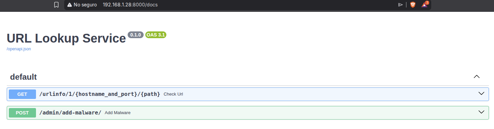
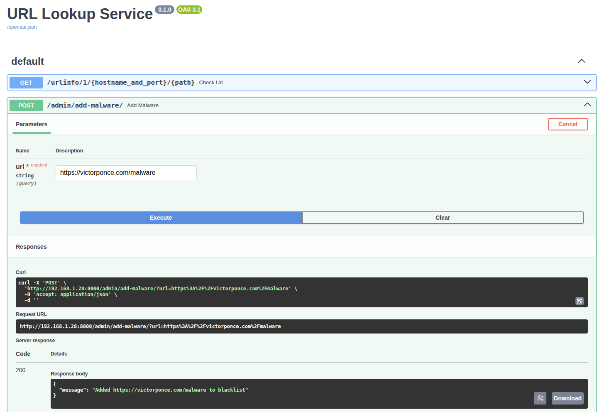
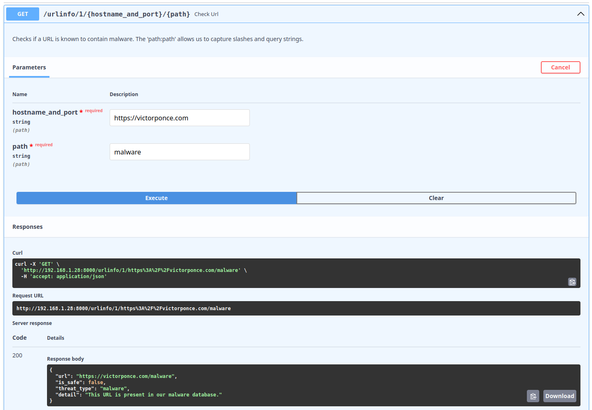

# Part 1 - URL Lookup Service

## Overview

This service allows an HTTP proxy to query a database of known malware URLs. 
The App is composed of an asynchronous web service that is built with Python (FastAPI) and SQLite

## Components

**FastAPI:** I choose it because it has native async/await support that is good for low latency, which is critical for a "blocking" proxy.

**SQLAlchemy + SQLite:** SQLite is a file-based database that makes this exercise runnable locally without complex infrastructure. SQLAlchemy will ensure that we can swap to PostgreSQL or RDS in production by changing a single connection string.

**Docker Compose:** Ensures a consistent runtime environment.

## Implementation

This solution uses Docker Compose that runs on Ubuntu Server 24.04 LTS. Apply the following steps to get the app up and running.

### 1. Configure the Ubuntu Server environment 

```
sudo apt update && sudo apt upgrade -y
sudo apt install docker.io -y
sudo apt install docker-compose-v2 -y
sudo usermod -aG docker $USER
newgrp docker
```

### 2. Clone the Repo and move to app folder

```
git clone https://github.com/victorhponcec/tasks-devops-aws.git
cd tasks-devops-aws/Part1/app/
```

### 3. Launch the service

```
docker compose up -d --build
```

### 4. Verify that the service is working

```
curl http://localhost:8000/urlinfo/1/google.com/search?q=test
```

## Testing

In the browser go to the URL http://192.168.1.28:8000/docs (replace 192.168.1.28 by the IP of the VM where Ubuntu is running or use localhost if you are running the app natively):

```
http://192.168.1.28:8000/docs
```

<div align="center">


<p><em>(img. 1 – Test Docs)</em></p>
</div>

Go to POST > “Try it Out” > Paste the URL > Execute:

<div align="center">


<p><em>(img. 2 – Test POST)</em></p>
</div>

If successful, you will get the message “"Added https://victorponce.com/malware to blacklist". Note that you can also add port at the end of the url like: “https://victorponce.com:443/malware”

Go to GET > “Try it Out” > fill the “hostname_and_port” and “path” boxes > Execute:

<div align="center">


<p><em>(img. 3 – Test GET)</em></p>
</div>

As shown in the capture, you will receive the message that the URL is present in the malware database.
